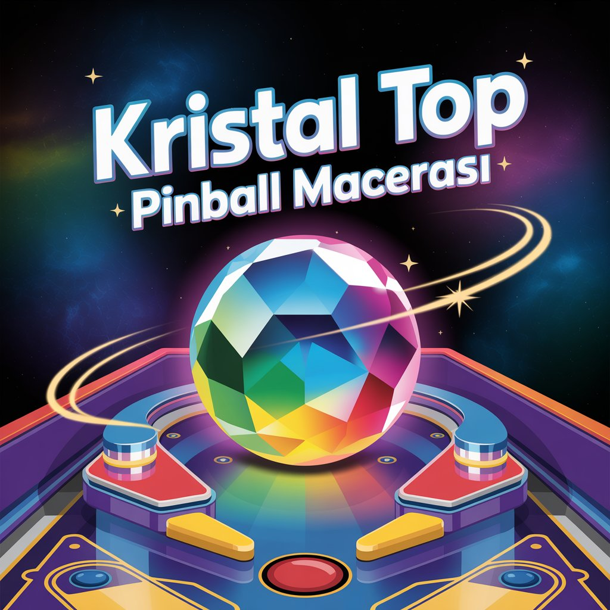

# Kristal Top: Pinball Macerası 🌟

  

<!-- Kısa ve etkileyici bir giriş veya slogan ekleyebilirsiniz -->
Kendi pinball sahanızı tasarlayın, kristal topunuzu fırlatın ve en yüksek skoru hedefleyin!

<!-- Oyununuzun çalışan halinin (GitHub Pages) bağlantısı -->
**➡️ Oyunu Oyna: [https://imane9607.github.io/Pinball_Macerasi/](https://imane9607.github.io/Pinball_Macerasi/) ⬅️**

<!-- Oyununuzun kısa bir tanıtım videosu (YouTube) -->
**📺 Oynanış Videosu:**
[Oynanış Videosunu İzle](https://www.youtube.com/watch?v=EKLENIZ_BURAYA)
<!-- Alternatif olarak videoyu gömebilirsiniz (isteğe bağlı): -->
<!--  -->

---

## 🎯 Proje Hakkında

Bu proje, Web Tabanlı Programlama dersi kapsamında geliştirilmiş bir HTML5 Canvas oyunudur. **Pinball Pioneer** adlı oyundan ilham alınarak, temel "tasarla ve oyna" pinball mekaniği JavaScript, HTML5 ve CSS kullanılarak yeniden hayata geçirilmiştir. Oyuncular, kendi pinball sahalarını çeşitli engellerle oluşturabilir ve ardından bu sahada kristal bir top ile en yüksek puanı elde etmeye çalışırlar.

**İlham Alınan Oyun:**
*   **Adı:** Pinball Pioneer
*   **Bağlantısı:** [https://alexeckardt.itch.io/pinball-pioneer](https://alexeckardt.itch.io/pinball-pioneer)
    *   *Bu oyun GMTK Game Jam 2020 için yapılmıştır.*

---

## 🎮 Oyun Mekanikleri ve Hedef

**Oyunun Temel Amacı:**
Oyun iki ana moddan oluşur: Tasarım Modu ve Oyun Modu.
1.  **Tasarım Modu:** Bu modda, oyun tahtasına çeşitli engeller (duvarlar, taşlar, ağaçlar, hızlandırıcılar) yerleştirerek kendi özel pinball sahanızı oluşturursunuz. Her engelin bir maliyeti vardır ve mevcut bakiyeniz dahilinde yerleşim yapabilirsiniz.
2.  **Oyun Modu:** Tasarladığınız sahada kristal topunuzu fırlatarak mümkün olan en yüksek puanı elde etmeye çalışırsınız. Topun engellere çarpması puan kazandırır. Belirli sayıda top hakkınız vardır.

**Hedef:**
*   Yaratıcı ve zorlayıcı pinball sahaları tasarlamak.
*   Oyun modunda en yüksek puanı elde etmek.
*   Farklı seviyelerde (arka plan temaları) oynayarak deneyimi çeşitlendirmek.
*   Engelleri stratejik yerleştirerek topun hareketini optimize etmek.

**Zorluk (Challenge):**
*   Sınırlı bakiye ile etkili bir saha tasarlamak.
*   Topu mümkün olduğunca uzun süre oyunda tutmak.
*   Flipper'ları (otomatik) en iyi şekilde kullanarak topu kurtarmak ve puan kazandıran hedeflere yönlendirmek.
*   Engellerin yerleşimi, topun hızını ve yönünü doğrudan etkiler, bu da stratejik düşünmeyi gerektirir.

---

## 🕹️ Kontroller

*   **Genel:**
    *   Ekrandaki düğmeler fare ile kontrol edilir.
*   **Tasarım Modu:**
    *   **Araç Seçimi:** Sağ paneldeki "Tasarım Araçları" bölümünden istediğiniz engeli (🧱, ❚, 🪨, 🌳, 🚀) veya silgiyi (⌫) seçin.
    *   **Engel Yerleştirme:** Seçili araçla oyun panosuna (canvas) tıklayarak engel yerleştirin.
    *   **Engel Silme:** Silgi aracını seçip silmek istediğiniz engele tıklayın.
    *   **Tümünü Temizle (🗑️):** Panodaki tüm engelleri temizler.
*   **Oyun Modu:**
    *   **Oyunu Başlat / Topu Fırlat:** Sağ paneldeki "Oyunu Başlat" (veya "Topu Fırlat") düğmesine tıklayarak oyunu başlatın veya yeni bir top fırlatın.
    *   **Tasarıma Dön:** Oyun devam ederken veya bittikten sonra tasarım moduna geri dönmek için bu düğmeyi kullanın.
    *   **Flipper'lar:** Flipper'lar top yaklaştığında otomatik olarak çalışır.

---

## ✨ Özellikler

*   **Dinamik Oyun Alanı Tasarımı:** Kendi pinball sahanızı oluşturun.
*   **Çeşitli Engeller:** Duvarlar, yan duvarlar, taş tamponlar, ağaç tamponlar ve hızlandırıcılar.
*   **Fizik Tabanlı Top Hareketi:** Gerçekçi yerçekimi, sürtünme ve sekme efektleri.
*   **Otomatik Flipper Mekanizması:** Topu oyunda tutmaya yardımcı olan akıllı flipper'lar.
*   **Puanlama ve Yüksek Skor Sistemi:** En iyi skorunuzu kaydedin ve geçmeye çalışın.
*   **Para Sistemi:** Engel yerleştirmek için kullanılan oyun içi para birimi.
*   **Seviye Sistemi:** Farklı arka plan temaları (Yeşil Orman, Çöl Vahası, Yıldızlar Uzayı, Gün Batımı Sahili).
*   **Programatik Ses Efektleri:** Top çarpışmaları, fırlatma, engel yerleştirme gibi çeşitli aksiyonlar için anlık sesler.
*   **Parçacık Efektleri:** Çarpışmalarda görsel geri bildirim sağlar.
*   **Duyarlı Arayüz (Responsive Design):** Farklı ekran boyutlarına uyum sağlar.
*   **Başlangıç Ekranı:** Oyuna hoş bir giriş sağlar.
*   **Yerel Kayıt (Local Storage):** En yüksek skor, bakiye ve mevcut seviye gibi veriler tarayıcıda saklanır.

---

## 📸 Ekran Görüntüleri

<!-- Oyununuzdan en az 2 tane güzel ekran görüntüsü ekleyin. -->
<!-- Örnek: -->
**Tasarım Modu:**

**Oyun Modu:**

<!-- Daha fazla ekran görüntüsü ekleyebilirsiniz -->
<!--
**Farklı Bir Seviye:**

-->

---

## 🛠️ Kullanılan Teknolojiler

*   **HTML5:** Oyunun temel yapısı ve `canvas` elementi.
*   **CSS3:** Arayüzün stilendirilmesi ve duyarlı tasarım.
*   **JavaScript (ES6+):** Oyunun tüm mantığı, fizik motoru, çizim işlemleri ve etkileşimler.
    *   *Not: Proje gereksinimleri doğrultusunda hiçbir harici JavaScript oyun kütüphanesi (Phaser, PixiJS vb.) kullanılmamıştır.*

---

## 🚀 Kurulum ve Çalıştırma

Oyunu oynamak için herhangi bir kurulum gerekmez. Modern bir web tarayıcısında (Chrome veya Firefox önerilir) yukarıdaki **"Oyunu Oyna"** bağlantısına tıklamanız yeterlidir.

Eğer projeyi yerel makinenizde çalıştırmak isterseniz:
1.  Bu repoyu klonlayın veya ZIP olarak indirin.
2.  `index.html` dosyasını web tarayıcınızda açın.

---

## 📝 Geliştirme Sürecinde Kullanılan Yapay Zeka Araçları

<!-- Bu bölümü AI.md dosyanızın bir özeti olarak düşünebilirsiniz veya doğrudan AI.md'ye yönlendirebilirsiniz. -->
<!-- Örnek: -->
Bu projenin geliştirilmesi sırasında zaman zaman ChatGPT-4 modelinden yardım alınmıştır. Kullanım detayları, sorulan "prompt"lar ve alınan cevaplar `AI.md` dosyasında bulunmaktadır.
*   **Kullanım Alanları:**
    *   Belirli JavaScript algoritmaları için fikir edinme (örn: temel çarpışma tespiti).
    *   CSS ile ilgili bazı stil sorunlarının çözümü.
    *   Kodda karşılaşılan hataların ayıklanması (debugging) için öneriler.
    *   Karmaşık fonksiyonlar için açıklayıcı yorumlar yazma konusunda yardım.

**Detaylar için bakınız: [AI.md](AI.md)**

---

## 📜 Asset Kaynakları

Bu projede kullanılan tüm görsel ve ses varlıkları programatik olarak JavaScript ile oluşturulmuştur veya standart emoji karakterleridir.

*   **Görsel Öğeler (Engeller, Arka Planlar):** JavaScript Canvas API kullanılarak dinamik olarak çizilmiştir. (örn: `drawPixelArtPattern`, `drawStaticBackgroundToBuffer`)
*   **Ses Efektleri:** Web Audio API (`AudioContext`, `OscillatorNode`) kullanılarak programatik olarak üretilmiştir. (örn: `playSound` fonksiyonu)
*   **Arka Plan Müziği:** "Town Theme" by cynicmusic - [Link](https://opengameart.org/content/town-theme-rpg) (CC-BY 3.0)
*   **Logo:** [Ideogram AI](https://ideogram.ai/) kullanılarak oluşturulmuştur.
*   **Font:** [Google Fonts - Cairo](https://fonts.google.com/specimen/Cairo) kullanılmıştır.

<!-- Eğer internetten hazır bir resim, ses dosyası veya farklı bir font kullandıysanız, buraya kaynaklarını eklemelisiniz. Örnek:
*   **Arkaplan Müziği:** "Cool Vibes" by Kevin MacLeod - [Link](https://incompetech.com/music/royalty-free/index.html?isrc=USUAN1100844) (CC BY 3.0)
*   **Oyuncu İkonu:** [www.flaticon.com](https://www.flaticon.com) adresinden "Pixel Star" ikonu by Freepik
-->

---

## 👤 Geliştirici

*   **Adınız Soyadınız:** Imane Keradi
*   **GitHub:** [imane9607](https://github.com/imane9607)

---

*Bu proje, Web Tabanlı Programlama dersi projesi olarak hazırlanmıştır.*
*© 2025 Tüm hakları saklıdır.*# Pinball_Macerasi

# Pinball_Macerasi

# Pinball_Macerasi

# Pinball_Macerasi

